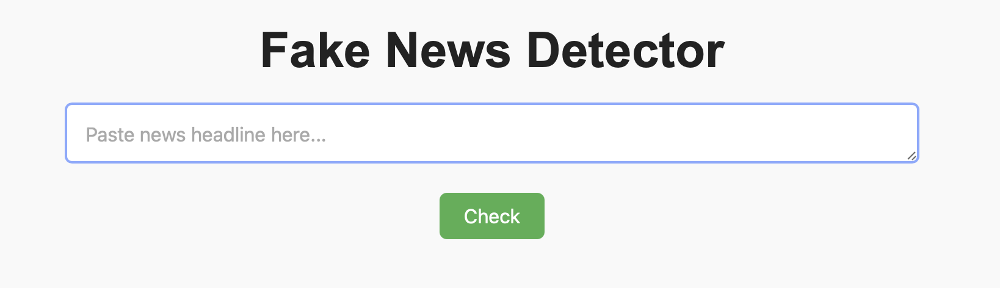

# Fake News Detector

A machine learning web app that classifies news as real or fake based on headlines

## Built with:
- Python
- scikit-learn
- Flask web app

## How it Works
### 1. Preprocessing
News headlines are cleaned using `nltk` and regular expressions.
### 2. Vectorization
Cleaned text is converted into a TF-IDF matrix using `scikit-learn`.
### 3. Model Training
A logistic regression model is trained on the Kaggle Fake/Real News dataset (`title` column only) and saved using `pickle`.
### 4. Web App
A Flask app allows users to enter a headline and get a prediction.

## Web App Interface

Datasets: https://www.kaggle.com/datasets/clmentbisaillon/fake-and-real-news-dataset?resource=download